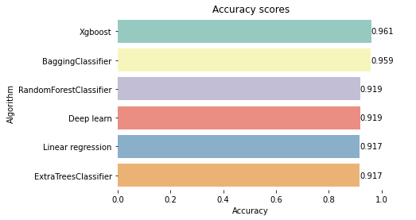
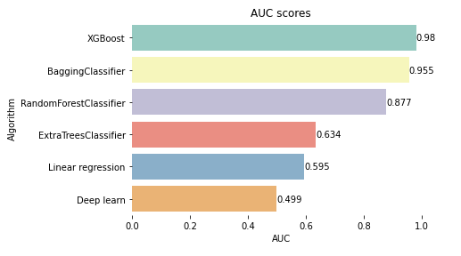
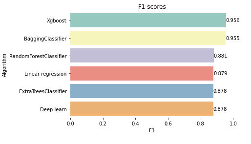

# P07-fast_growing_comp

## About The Project

Many new companies are being established monthly. 
Bank needs a faster way to find fast-growing companies to provide daily banking solutions and financing.

This project was done with publicly available data from Estonian Tax Office and mainly using Quarterly turnover and tax payment info.

For data labeling it was used Compound Quarterly Growth Rate

## Results
Logistic Regression, ExtraTrees Classifier, RandomForestClassifier, Bagged DT, XGBoost and Deep learning were tested. Here are results:

(<a href="#top">back to top</a>)

## License

Distributed under the MIT License. See `LICENSE.txt` for more information.

(<a href="#top">back to top</a>)

## Authors

Roland Pajuleht,
Lisanna Lehes, 
Simo Jaanus, 
Kertu Nurmberg

Project Link: [https://github.com/sjaanus97/P07-fast_growing_comp](https://github.com/sjaanus97/P07-fast_growing_comp)

(<a href="#top">back to top</a>)
